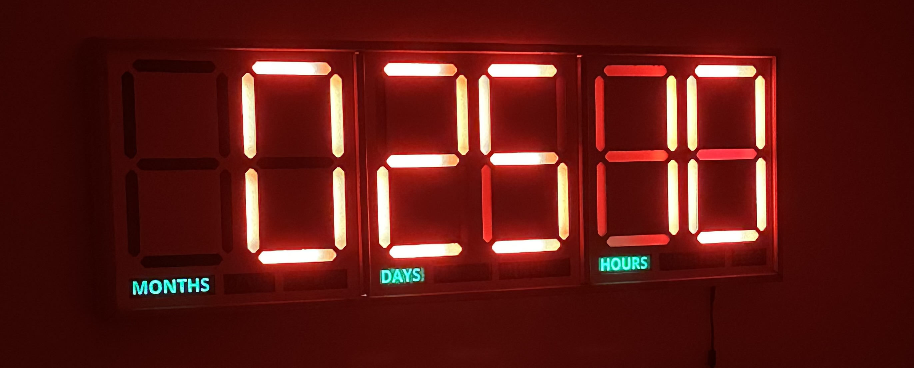

Countdown clock
===============

This repository contains the code to run the Countdown Clock, a 1.23x0.43 meter wall-mounted device designed to remind your colleagues that the deadline is fast approaching! [Gamer mode](media/gamer_mode.mp4) purchased separately.

It's written in Arduino and targets the NodeMCU-32S board.
Follow [these](https://randomnerdtutorials.com/installing-the-esp32-board-in-arduino-ide-windows-instructions/) instructions to install the Arduino board.

There are two sketches: 
- [DS3231_set](https://github.com/jdiez17/countdown_clock/tree/main/sketches/DS3231_set) is used to set the RTC time.
- [countdown](https://github.com/jdiez17/countdown_clock/tree/main/sketches/countdown) is the main software that will update the remaining time.

How to
======

Set the time
------------

To set the time, connect the control board to your computer via USB and upload the `DS3231_set` sketch.
You may need to press the user/reboot buttons on the NodeMCU board to enter upload mode.
After the sketch is uploaded, open a serial terminal and send a string like this:

    YYMMDDwHHMMSSx

Where `YY` is the year, `MM` is the month, `DD` is the day, `w` is the day of the week (monday=0, tuesday=1, ...), `HH` is the 24-hour time, `MM` are the minutes, and `SS` are the seconds. 'x' is a termination character.

For example, to set the date to 2024-03-07 07:20:30 you would send:

    2403074072030x

The serial readback should tell you that you have updated the time.
After that, you can go ahead and flash the coundown sketch.

Improvement ideas
=================

- 🏆 Figure out why the RTC doesn't keep the time when it is powered off
- Adding WiFi/BLE support to set the time (RTC time and target countdown time) remotely
- Doing something with the RGB LEDs

